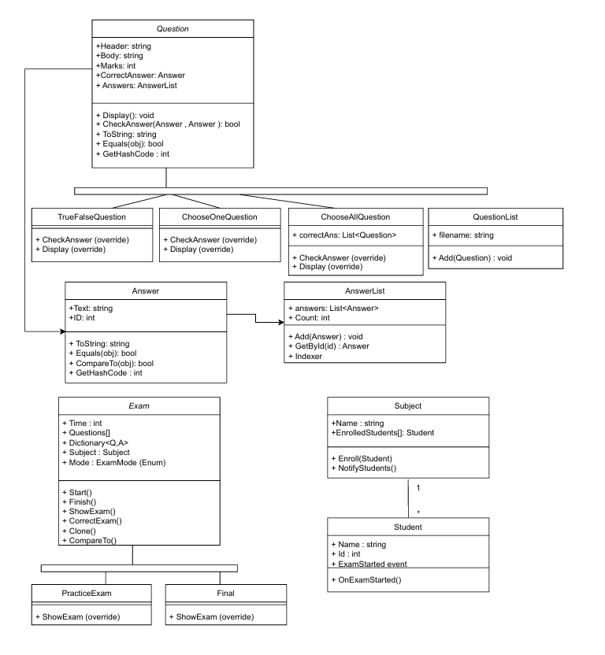

# C# Examination System

A console-based **Examination System** in C# demonstrating OOP principles, abstract classes, polymorphism, events, and file handling.

---

## Features

- Create **Subjects** and enroll **Students**.
- Support **Practice Exams** and **Final Exams** with separate question sets.
- Support **True/False**, **Choose One**, and **Choose All** question types.
- Students receive notifications when exams start (**event-driven**).
- Exams calculate and display results for Practice Exams.
- Questions are automatically logged to a file (`questions.txt`).
- Supports multiple students and exams.

---

## Project Structure

- `Program.cs` – Main program to run exams and interact with user.
- `Question.cs` – Abstract base class for all question types.
- `TrueFalseQuestion.cs`, `ChooseOneQuestion.cs`, `ChooseAllQuestion.cs` – Derived question types.
- `Answer.cs` – Represents an answer option.
- `AnswerList.cs` – Collection of answers.
- `QuestionList.cs` – Stores questions and logs them to a file.
- `Exam.cs` – Abstract base class for exams.
- `PracticeExam.cs`, `FinalExam.cs` – Derived exam types.
- `Student.cs` – Represents a student and exam event handler.
- `Subject.cs` – Represents a subject and enrolled students.
- `ExamEventArgs.cs` – Event arguments for exam start notifications.

---

## Getting Started

### Requirements

- [.NET 7.0 SDK](https://dotnet.microsoft.com/download/dotnet/7.0) or later
- Any C# IDE (Visual Studio, VS Code, JetBrains Rider)

### Running in VS Code

1. Clone or download the project.
2. Open the project folder in VS Code.
3. Open a terminal in VS Code.
4. Build the project:

   ```bash
   dotnet build
   ```

### How to Use

1. Students are pre-created in `Program.cs`.
2. Questions are stored in `QuestionList` and saved to `questions.txt`.
3. Practice exams show:
   - All questions
   - Student answers
   - Correct answers
   - Final grade
4. Final exams show:
   - Questions
   - Student answers only
   - Correct answers are hidden
5. Students are notified when an exam starts via the event system.
6. The user selects the exam type from the console and follows prompts to answer each question.
7. After the exam, the results (for Practice) or student answers (for Final) are displayed in the console.

---

## Project Highlights

- **Polymorphism:** Different question types override `Display()` and `CheckAnswer()`.
- **Events:** Students subscribe to `ExamStarted` event to receive notifications.
- **File I/O:** All questions are logged to `questions.txt`.
- **Validation:** Constructor checks for nulls, empty strings, and invalid marks.
- **Collections:** Custom `AnswerList` and `QuestionList` classes.
- **Clone & Compare:** Exams implement `ICloneable` and `IComparable<Exam>` for comparison and cloning.
- **Separate Subjects:** Practice and Final exams use separate subjects and question sets.
- **Interactive Console:** Students select answers via console input.

---

### How to Use

1. Students are pre-created in `Program.cs`.
2. Questions are stored in `QuestionList` and saved to `questions.txt`.
3. Practice exams show:
   - All questions
   - Student answers
   - Correct answers
   - Final grade
4. Final exams show:
   - Questions
   - Student answers only
   - Correct answers are hidden
5. Students are notified when an exam starts via the event system.
6. The user selects the exam type from the console and follows prompts to answer each question.
7. After the exam, the results (for Practice) or student answers (for Final) are displayed in the console.

---

## UML Class Diagram

Here is the UML class diagram for the Examination System project:


